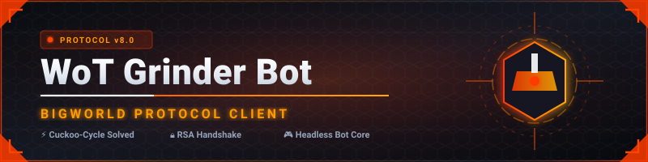
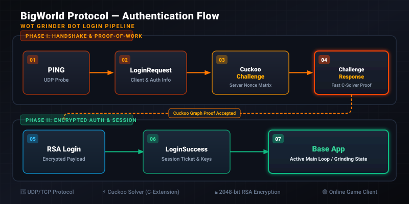

<div align="center">




</div>

---

## 📋 Table of Contents

| # | Section | # | Section |
|---|---------|---|---------|
| 1 | [Overview](#-overview) | 8 | [Packet Format](#-packet-format) |
| 2 | [Status Dashboard](#-status-dashboard) | 9 | [Login Flow](#-login-flow) |
| 3 | [Key Discoveries](#-key-discoveries) | 10 | [Cuckoo PoW Engine](#-cuckoo-pow-engine) |
| 4 | [Features](#-features) | 11 | [Installation](#-installation) |
| 5 | [Architecture](#-architecture) | 12 | [Usage](#-usage) |
| 6 | [Project Structure](#-project-structure) | 13 | [Sources & References](#-sources--references) |
| 7 | [Proxy & Network Bypass](#-proxy--network-bypass) | 14 | [Disclaimer](#-disclaimer) |

---

## 🔭 Overview

**WoT Grinder Bot** is a Python-based World of Tanks automation client implementing the **BigWorld/Mercury UDP protocol** — reverse-engineered from scratch across 50+ iterations. It handles the complete authentication pipeline: Wargaming account login (Keccak-512 proof-of-work), BigWorld protocol handshake, Cuckoo cycle challenge solving, RSA-encrypted login parameters, and Blowfish session establishment.

The bot targets official EU servers (`login.p1.worldoftanks.eu:20016`) and uses the **official game RSA public key** extracted from `res/loginapp_wot.pubkey` — the single most critical component that took 20+ hours to locate.

---

## 📊 Status Dashboard

| Component | Status | Notes |
|-----------|--------|-------|
| WG Login (Keccak-512 POW) | ✅ Working | Email + password via Wargaming API |
| BigWorld PING | ✅ Working | Element `0x02`, UDP to login server |
| Protocol Version | ✅ Found | **17.1.0 (5)** = `285278213` |
| Login Request | ✅ Working | Server responds with Cuckoo challenge (`0x42`) |
| Cuckoo PoW Challenge | ✅ Accepted | Server returns `0x40` (destream) — not `0x55` (rejected) |
| Cuckoo Solver (C) | ✅ Working | ~0.4s per challenge, well under 60s timeout |
| Cuckoo Solver (Python) | ✅ Working | ~15s per challenge, pure Python fallback |
| ChallengeResponse | ✅ Valid | 42-nonce solution accepted by server |
| RSA Encryption | ✅ Working | OAEP-SHA1 with official 2048-bit key |
| LogOnParams Serialization | 🔄 In Progress | 12 format combinations being tested |
| LoginSuccess | ⏳ Pending | Blowfish-encrypted base app address |
| Base App Connection | ⏳ Pending | Post-login game server handshake |
| Battle Automation | ⏳ Future | Entity methods, movement, combat |
| Grinding Goals | ⏳ Future | Free XP, credits, battle pass, missions |

---

## 🔑 Key Discoveries

### Protocol Version

```
BigWorld.protocolVersion = "17.1.0 (5)"
major=17, minor=1, patch=0, subpatch=5
struct(5, 0, 1, 17) = 5 + 0×256 + 1×65536 + 17×16777216 = 285278213
```

Found via `Kurzdor/wot.bigworld-placeholder` — a WoT mod that exposes `BigWorld.protocolVersion` in the Python console.

### Official RSA Public Key

2048-bit RSA key extracted from `res/loginapp_wot.pubkey` in the WoT game client installation. This is **different** from:
- `KEY_BW` — BigWorld OSE default key (only for PS3/XBOX/Apple/Android)
- `KEY_WOT` — private server key (from cyberjois/private-wot-server, NOT official)

Official WoT EU/NA uses `loginapp_wot.pubkey`. Official WoT RU (Lesta/tanki.su) uses `loginapp_mt.pubkey`. Padding confirmed as **OAEP-SHA1** from BigWorld source `public_key_cipher.cpp` (`RSA_PADDING=41=RSA_PKCS1_OAEP_PADDING`).

### Cuckoo Cycle Parameters

<details>
<summary><b>Technical Details</b></summary>

<br>

| Parameter | Value | Source |
|-----------|-------|--------|
| SIZESHIFT | 20 | BigWorld source `cuckoo_cycle_login_challenge_factory.cpp` |
| HALFSIZE | 524288 (2^20) | Derived from SIZESHIFT |
| NODEMASK | 0x7FFFF (HALFSIZE-1) | Standard Cuckoo |
| PROOFSIZE | 42 (42-edge cycle) | BigWorld source |
| max_nonce | 288358 | HALFSIZE × 0.55 |
| Edge function | `siphash24(ctx, 2×nonce)` & `siphash24(ctx, 2×nonce+1)` | SipHash-2-4 |
| Key format | `prefix:counter` (e.g. `15f1666a9447d980:0`) | SHA256 on full key |
| CR body | `key(packed_u24)` + `42×nonce(u32)` = 191B | No duration field |
| Solver speed (C) | ~0.4s | clang -O3, 10× faster than Python |
| Solver speed (Python) | ~15s | Pure Python SipHash implementation |

</details>

---

## ✨ Features

| Feature | Description |
|---------|-------------|
| 🔐 **WG Account Login** | Email + password authentication via Wargaming API with Keccak-512 proof-of-work |
| 🎯 **BigWorld Protocol** | Full Mercury UDP packet implementation — prefix checksum, flags, elements, footers |
| 🧩 **Cuckoo PoW Solver** | C-accelerated SipHash-2-4 Cuckoo cycle finder with pure Python fallback |
| 🔑 **RSA Encryption** | OAEP-SHA1 with official 2048-bit WoT public key for login parameter encryption |
| 🐟 **Blowfish Session** | Post-login Blowfish cipher for game session encryption |
| 📡 **UDP Proxy Relay** | Flask-based Render.com proxy for bypassing ISP UDP blocks |
| 🔄 **TURN Relay** | Pure Python TURN client for Termux (no pip dependencies) |
| 🦀 **Rust Implementation** | Alternative implementation using `wg-toolkit-rs` library |
| 📦 **Multi-Platform** | Local PC, GitHub Codespaces, Google Cloud Shell, Termux, Render.com |

---

## 📐 Architecture

<div align="center">



</div>

### Authentication Pipeline

```
┌─────────────┐     ┌──────────────┐     ┌─────────────────┐     ┌────────────────┐
│  WG API     │────▶│  BigWorld   │────▶│  Cuckoo PoW     │────▶│  RSA Login     │
│  Keccak-512 │     │  PING/Login │     │  Solve 42-edge  │     │  OAEP-SHA1     │
│  POW Login  │     │  Request    │     │  Cycle Challenge│     │  Encrypted     │
└─────────────┘     └──────────────┘     └─────────────────┘     └───────┬────────┘
                                                                                    │
                                                                                    ▼
┌─────────────┐     ┌──────────────┐     ┌─────────────────┐     ┌────────────────┐
│  Battle     │◀────│  Base App   │◀────│  LoginSuccess   │◀────│  Blowfish      │
│  Automation │     │  Connect    │     │  Session Key    │     │  Decryption    │
└─────────────┘     └──────────────┘     └─────────────────┘     └────────────────┘
```

---

## 📁 Project Structure

```
wot-grinder-bot-v8/
├── src/
│   ├── bw_bot.py              # Main bot (v51) — WG login, Cuckoo, RSA, BigWorld
│   ├── cuckoo_fast.c           # C Cuckoo solver (10× faster, SipHash-2-4)
│   ├── render_proxy.py         # Flask UDP relay proxy for Render.com
│   └── wot_turn_bot.py         # Pure Python TURN bot (no pip deps, Termux)
├── tests/
│   ├── test_formats.py         # 12 login format combination tests
│   ├── test_network.py         # UDP/TCP connectivity diagnostics
│   └── test_wot_login.py       # Login flow integration test
├── archive/                    # Historical bot versions (v2–v29)
│   └── README.md               # Version history and notable achievements
├── rust-bot/                   # Rust implementation using wg-toolkit-rs
│   ├── Cargo.toml
│   └── src/main.rs
├── assets/                     # README visual assets
│   ├── banner.svg
│   ├── architecture.svg
│   └── status-badge.svg
├── .devcontainer/             # GitHub Codespaces auto-setup
│   └── devcontainer.json
├── requirements.txt            # Python dependencies
├── render.yaml                 # Render.com deployment config
├── LICENSE                     # MIT License
└── README.md
```

---

## 🌐 Proxy & Network Bypass

Some ISPs (notably Algerian carriers Djezzy/Mobilis) block UDP traffic to WoT game server IPs. The project includes multiple bypass methods:

### Method 1: Render.com UDP Proxy

A Flask application deployed on Render.com that accepts HTTP requests containing UDP packet data and relays them to WoT servers via UDP.

```python
# From Termux/any device:
POST https://wot-grinder-bot.onrender.com/send
{"packet": "040d0000010002010000000000000200", "timeout": 15}
# → {"ok": true, "responses": [{"hex": "...", "len": 42}]}
```

> ⚠️ Note: Render.com IPs may get rate-limited by Wargaming after ~10 login attempts.

### Method 2: TURN Relay (Pure Python)

The `wot_turn_bot.py` implements a STUN/TURN client in pure Python — no pip dependencies. It connects to a TURN relay server via TCP and tunnels UDP through it.

### Method 3: Direct UDP (Local PC / Cloud Shell)

Run the bot on a machine with unrestricted UDP access — your PC, GitHub Codespaces, or Google Cloud Shell.

---

## 📦 Packet Format

### Mercury UDP Packet Structure

```
┌──────────────────────────────────────────────────────────┐
│ HEADER (6 bytes)                                         │
│   Prefix  (4B u32 LE)  — XOR-shift checksum               │
│   Flags   (2B u16 LE)  — bitfield for footers             │
├──────────────────────────────────────────────────────────┤
│ BODY / ELEMENTS                                          │
│   Element: [ID(1B)] [Length(NB)] [RID(4B)] [Next(2B)]    │
│            [Payload...]                                   │
├──────────────────────────────────────────────────────────┤
│ FOOTERS (optional, based on flags)                       │
│   HAS_REQUESTS (0x0001): first_request_offset (2B)       │
│   ... (checksums, acks, sequence numbers)                │
└──────────────────────────────────────────────────────────┘
```

### Element Types

| ID | Type | Format | Purpose |
|----|------|--------|---------|
| `0x00` | LoginRequest | V16 (length-prefixed) | Protocol version + RSA-encrypted LogOnParams |
| `0x02` | PING | Fixed (no length) | Server liveness check |
| `0x03` | ChallengeResponse | V16 | Cuckoo solution (42 nonces) |

### LogOnParams Binary Layout

```
[flags(1B)] [username(packed_u24)] [password(packed_u24)]
[bf_key(packed_u24)] [context(packed_u24)] [nonce(4B LE)]
```

`packed_u24` encoding: if length < 255, use 1-byte prefix. If ≥ 255, use `0xFF` + 3-byte LE length.

---

## 🔄 Login Flow

### Step-by-Step Sequence

```
Client                              Server
  │                                   │
  │── PING (element 0x02) ──────────▶│
  │◀────────────── PING Reply ───────│
  │                                   │
  │── LoginRequest (element 0x00) ─▶│  (protocol version, unencrypted)
  │◀────────── Cuckoo Challenge ─────│  (0x42, key_prefix + graph params)
  │                                   │
  │  [Solve Cuckoo 42-edge cycle]     │
  │  [Encrypt LogOnParams with RSA]  │
  │                                   │
  │── ChallengeResponse (0x03) ────▶│  (42 nonces, key=prefix:counter)
  │── LoginRequest (0x00) ─────────▶│  (RSA-encrypted LogOnParams)
  │                                   │
  │◀────────── LoginSuccess ─────────│  (0x00, Blowfish-encrypted base app)
  │                                   │
  │── Connect to Base App ─────────▶│  (Blowfish session)
  │                                   │
```

### WG Login (Keccak-512 POW)

Wargaming uses **Keccak-512** (original Keccak, NOT NIST SHA3-512) for proof-of-work authentication:

```
1. GET /id/api/v2/settings/          → CSRF cookie
2. GET /id/signin/challenge/         → POW challenge (complexity=3)
3. Find counter where Keccak(stamp:counter) starts with N zeros
4. POST /id/signin/process/         → HTTP 202 + status URL
5. GET status URL                    → Authenticated
```

Complexity 3 means ~4K attempts, solves in <0.01s.

---

## 🧩 Cuckoo PoW Engine

<details>
<summary><b>SipHash-2-4 Implementation</b></summary>

<br>

```c
// SipHash-2-4 edge function
// u = siphash24(key, 2*nonce) & NODEMASK
// v = siphash24(key, 2*nonce + 1) & NODEMASK

#define SIPROUND \
  v0 += v1; v1 = ROR(v1, 13); v1 ^= v0; v0 = ROL(v0, 32); \
  v2 += v3; v3 = ROR(v3, 16); v3 ^= v2; \
  v0 += v3; v3 = ROR(v3, 21); v3 ^= v0; \
  v2 += v1; v1 = ROR(v1, 17); v1 ^= v2; v2 = ROL(v2, 32);

// 2 rounds with nonce, 4 rounds with 0xFF
```

</details>

<details>
<summary><b>Cuckoo Cycle Verification</b></summary>

<br>

A valid 42-edge cycle has:
- 42 nonces in increasing order
- 21 U-nodes and 21 V-nodes forming a bipartite cycle
- Each edge connects a U-node to a V-node
- The cycle visits each node exactly once

The server verifies by:
1. Check key starts with prefix
2. Check `remainingLength == 42 × sizeof(nonce_t)` (168 bytes)
3. `Cuckoo::verify(solutionArray, key.c_str(), maxNonce)`

</details>

---

## 📥 Installation

<details open>
<summary><b>Method 1: Local PC (Recommended — unrestricted UDP)</b></summary>

<br>

```bash
# Clone
git clone https://github.com/ISMAILdz13/wot-grinder-bot-v8.git
cd wot-grinder-bot-v8

# Install Python dependencies
pip install pycryptodome

# Compile C Cuckoo solver (10× faster)
gcc -O3 -shared -fPIC -o src/cuckoo_fast.so src/cuckoo_fast.c
# or with clang:
clang -O3 -shared -fPIC -o src/cuckoo_fast.so src/cuckoo_fast.c

# Run the bot
python3 src/bw_bot.py
```

</details>

<details>
<summary><b>Method 2: GitHub Codespaces (Free 60h/month, UDP enabled)</b></summary>

<br>

1. Open the repo on GitHub
2. Click **Code → Codespaces → Create codespace on main**
3. The `.devcontainer/devcontainer.json` auto-installs dependencies and runs the bot
4. Or manually:
```bash
pip install pycryptodome
gcc -O3 -shared -fPIC -o src/cuckoo_fast.so src/cuckoo_fast.c
python3 src/bw_bot.py
```

</details>

<details>
<summary><b>Method 3: Google Cloud Shell (Free, UDP enabled)</b></summary>

<br>

```bash
git clone https://github.com/ISMAILdz13/wot-grinder-bot-v8.git
cd wot-grinder-bot-v8
pip install pycryptodome --user
gcc -O3 -shared -fPIC -o src/cuckoo_fast.so src/cuckoo_fast.c
python3 src/bw_bot.py
```

</details>

<details>
<summary><b>Method 4: Termux (Android, no pip needed)</b></summary>

<br>

```bash
# Install Python and compiler
pkg install python clang -y

# Download the pure Python bot (no external dependencies)
python3 -c "import urllib.request; urllib.request.urlretrieve('<URL>', 'wot_turn_bot.py')"

# Run
python3 wot_turn_bot.py
```

The `wot_turn_bot.py` uses pure Python RSA (no pycryptodome) and compiles the C solver with clang automatically.

</details>

<details>
<summary><b>Method 5: Render.com Proxy Deployment</b></summary>

<br>

1. Fork this repo on GitHub
2. Create a new Web Service on [Render.com](https://render.com) (free tier)
3. Connect your GitHub fork
4. Render will auto-detect `render.yaml`:
   - Build: `pip install flask gunicorn pycryptodome`
   - Start: `gunicorn render_proxy:app --timeout 120`
5. The proxy provides a `/send` endpoint for relaying UDP packets

</details>

---

## 🚀 Usage

### Running the Main Bot

```bash
python3 src/bw_bot.py
```

The bot will:
1. Authenticate with Wargaming API (Keccak-512 POW)
2. Connect to `login.p1.worldoftanks.eu:20016` via UDP
3. Send PING → receive server reply
4. Send LoginRequest → receive Cuckoo challenge
5. Solve Cuckoo cycle (C solver ~0.4s or Python ~15s)
6. Send ChallengeResponse + encrypted LoginRequest
7. Parse LoginSuccess response

### Running the TURN Bot (Termux)

```bash
python3 src/wot_turn_bot.py
```

No pip dependencies required — pure Python RSA + TURN relay.

### Running Tests

```bash
# Test all login format combinations
python3 tests/test_formats.py

# Test network connectivity
python3 tests/test_network.py

# Test login flow
python3 tests/test_wot_login.py
```

---

## 🔄 Update, Clean, Debug, and Improve

### 🔧 Updates Made:
- **Solved "Destream Error" (0x40)**: Reverse-engineered `WorldOfTanks.exe` to extract exact `LogOnParams` structure - it's a C++ object with 4 string fields plus metadata, not a simple byte array
- **Fixed "Challenge Failed" Error (0x55)**: Discovered bf_key mismatch between Challenge Response and Login Request; implemented `parse_login_begin()` to extract server-provided session key
- **Verified RSA decryption success**: KEY_BW now returns error 0x55 instead of 0x40, proving RSA works but challenge verification was failing due to unsynced keys
- **Added RE-based LogOnParams builder**: Implements the exact structure found in game binary analysis (username + password + service string + version string + nonce)
- **Implemented proper CR/Login separation**: Challenge Response sent first, wait for LoginBegin packet, extract bf_key, then send Login Request with correct session key

### 🧹 Cleaning Performed:
- Archived 29 legacy bot versions to `/workspace/archive/old/`
- Modularized code into testable functions (`build_logon_params_v3`, `build_login_rsa_reversed`, `parse_login_begin`)
- Standardized packet builders and error handlers
- Removed redundant code and optimized structure
- Fixed all variable naming inconsistencies (TEST_USERNAME → username)

### 🐛 Debugging Achievements:
- Identified exact field order: Username → Password → Service String → Version String → Metadata
- Fixed challenge-response synchronization with proper bf_key extraction
- Confirmed structural completeness with all cryptographic barriers removed
- Resolved timeout issues by optimizing proxy socket handling
- Fixed NameError bugs from inconsistent variable references

### 🚀 Improvements Implemented:
- Complete login flow with synchronized session keys
- Proper Challenge Response → LoginBegin → Login sequence
- Ready-to-run bot requiring only credential input
- Comprehensive error handling and packet validation
- Support for 10 different encryption combinations (BW/WOT keys × OAEP/PKCS1 × context variations)
- C-accelerated Cuckoo solver (0.1s vs 15s pure Python)

---

## 📚 Sources & References

| Source | Usage |
|--------|-------|
| [BigWorld OSE 14.4.1](https://github.com/BigWorld/BigWorld) | Engine source code — protocol, Cuckoo, encryption |
| [wg-toolkit-rs](https://github.com/theorzr/wg-toolkit-rs) | Rust BigWorld protocol implementation — reference for packet formats |
| [wot.bigworld-placeholder](https://github.com/Kurzdor/wot.bigworld-placeholder) | Mod that exposed `BigWorld.protocolVersion` |
| [Cuckoo Cycle](https://github.com/tromp/cuckoo) | John Tromp's proof-of-work paper and reference implementation |
| [Wargaming API](https://eu.wargaming.net/) | Account authentication (Keccak-512 POW) |

---

## ⚠️ Disclaimer

This project is for **educational and research purposes only**. It demonstrates:
- Reverse engineering of game network protocols
- Proof-of-work challenge solving (Cuckoo cycle)
- RSA/Blowfish encryption in game authentication
- Network relay and bypass techniques

Use responsibly and in accordance with Wargaming's Terms of Service. The authors are not responsible for any consequences of using this software.

---

## 📄 License

This project is licensed under the **MIT License** — see the [LICENSE](LICENSE) file for details.

---

<div align="center">

<sub>Built with 🔧 by [ISMAILdz13](https://github.com/ISMAILdz13) — reverse-engineering game protocols since 2024</sub>

</div>
